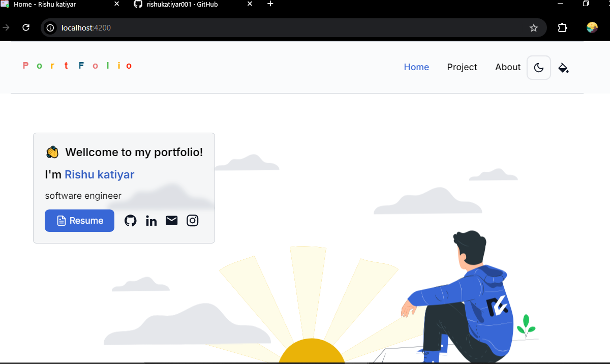

# 🚀 [Rishu Katiyar](https://github.com/rishukatiyar001)

🌍 **Live Demo** → [Click Here 🚀](https://rishukatiyar-portfolio.vercel.app/)  

---

## 📸 Preview
<p align="center">
  <picture>
    <source media="(prefers-color-scheme: dark)" srcset="./preview-dark.png">
    <source media="(prefers-color-scheme: light)" srcset="./preview.png">
    
  </picture>
</p>

---

## 🛠️ Tech Stack
- ⚡ **Framework** → [Angular](https://angular.dev/)
- 🎨 **Styling** → [Tailwind CSS](https://tailwindcss.com/)
<!-- - ☁️ **Deployment** → [Vercel](https://vercel.com/) -->

---

## ✨ Features
✔️ **Glassmorphism Navbar**  
✔️ **Toolbar Color Theme Selector**  
✔️ **Light & Dark Mode Support**  
✔️ **Spotlight Glow Hover Card**  
✔️ **Devicon with Tooltip**  

---

## 📂 Sections
📌 **Intro Image**  
📌 **Expertise Area**  
📌 **Languages & Tools**
📌 **About Me** 
📌 **Projects**  

---

## ⚡ Running Locally

### **📌 Prerequisites**
This application requires **Node.js v18.13+**  

### **🚀 Installation Steps**
```bash
# Install Angular CLI globally (if not installed)
npm install -g @angular/cli

# Clone the repository
git clone https://github.com/rishukatiyar001/Rishukatiyar-Portfolio.git

# Navigate to the project directory
cd Rishukatiyar-Portfolio

# Install dependencies
npm install
```

---
### **🛠️ Configure Environment**
1️⃣ Navigate to src/environments/ <br/>
2️⃣ Rename environment.ts.bak → environment.ts <br/>
3️⃣ Rename environment.development.ts.bak → environment.development.ts <br/>

### **🛠️ 🤝 Contributing**
🎯 Want to contribute?

🍴 Fork the repository
🌿 Create a new branch → git checkout -b feature-branch <br/>
📝 Make your changes & commit → git commit -m "Your message" <br/>
🚀 Push to the branch → git push origin feature-branch <br/>
✅ Open a Pull Request 


### **⭐ Show Your Support!**

If you like this project, don't forget to:<br/> 
💙 Star the repo → ⭐ <br/>
🐦 Follow me on GitHub → Rishu Katiyar

🌟 Live Demo →  [Click Here 🚀](https://rishukatiyar-portfolio.vercel.app/) 
